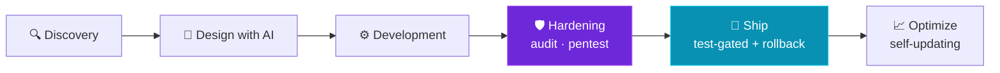

<div align="center">


[](https://athulrajpalayi.com)

<br/>

[](https://athulrajpalayi.com)
[](https://linkedin.com/in/athulraj-palayi)
[](https://wa.me/971582903572)
[](mailto:imathulraj@gmail.com)


&nbsp;

&nbsp;


</div>

## `> whoami`

```ts
const athulraj = {
  role      : "IT Executive @ Shaji Coatings LLC",
  alias     : ["ethical hacker", "vibe coder", "AI product builder"],
  based_in  : "Dubai, UAE",
  cert      : "CEH v10",
  method    : "direct AI like an engineering team — human architecture, superhuman velocity",
  believes  : "secure, useful, practical software that solves real business problems",
  status    : "shipping across web · desktop · mobile · hardware",
};
```

I break systems to understand them, then build them better. I run the technology behind a paint
business by day and ship production apps — from industrial-hardware integration to conversational
AI over live company data — with security baked in, not bolted on.

<div align="center">

`🛡️ Cybersecurity & Ethical Hacking` &nbsp; `🤖 AI-Assisted Development` &nbsp; `📱 Android & Web Apps`
`⚙️ Business Automation` &nbsp; `🔗 API & Platform Integration` &nbsp; `🖥️ Desktop Tools`

</div>


## `> ./deploy --pipeline`



Six stages, every project. Architecture and security stay human; AI is the pair that keeps the
velocity high. Nothing ships without automated tests passing *first* and a rollback point ready.

## `> ls ./projects`

<table>
<tr>
<td width="50%" valign="top">

### 🎨 Shaji Color Vision
**Flagship · live in production**

Brand-neutral automotive **paint colour-matching & mixing** — one codebase, **three apps** (web ·
self-updating Windows desktop · Android).

`213,000+` colours · camera **QR + OCR** scan · **X-Rite spectrophotometer** matching ·
scale-driven gravimetric mixing · 3D paint preview · cross-branch analytics · multi-tenant SaaS,
**encrypted at rest**.

`Flask` `React·TS` `Electron` `Capacitor` `SQLCipher`
🔗 [mix.shajipaints.com](https://mix.shajipaints.com)

</td>
<td width="50%" valign="top">

### 🤖 Shaji AI
**Conversational business intelligence**

Ask live company data in **plain English or voice** → grounded answers, charts, and one-click
**PDF/Excel/Word/PPT** reports.

**~29 AI tools** over the DB · invoice-photo OCR · payment-health scoring · cash-flow forecasting ·
7am email briefing · WhatsApp delivery. **Strictly read-only — no hallucinated numbers.**

`Angular` `Node·Express` `MongoDB` `AWS Bedrock·Claude` `Deepgram`

</td>
</tr>
<tr>
<td width="50%" valign="top">

### ⚖️ Shaji Mixing System
**Hardware ↔ browser, no middleware**

Industrial lab balances (**Sartorius · Mettler Toledo**) stream **live weights straight into Chrome
over the Web Serial API** — plug in USB and mix.

Multi-protocol serial parser · lag-free live display · barcode ingredient selection. The
predecessor that grew into Color Vision.

`Angular` `Web Serial API` `MT-SICS / SBI`

</td>
<td width="50%" valign="top">

### 💬 WhatsApp Automation Platform
**Meta Cloud API SaaS**

Bulk messaging, **scheduled campaigns**, customer-list uploads, and reply management on the
official **Meta WhatsApp Cloud API**.

`Next.js` `Node.js` `Supabase` `Meta WhatsApp API`

</td>
</tr>
<tr>
<td width="50%" valign="top">

### 📁 DOCAS — Document Collection
**HR onboarding, minus the chasing**

Bilingual **EN/Arabic (RTL)** portal: secure **expiring, no-login upload links**, live submission
dashboard, Excel reports. Pluggable **Local / Google Drive / OneDrive** storage.

`Next.js 16` `React 19` `Prisma·PostgreSQL` `JWT`

</td>
<td width="50%" valign="top">

### 🧾 ERP → Zoho ZATCA Integration
**Compliance on autopilot**

ERP-to-Zoho API bridge for **ZATCA e-invoicing** — invoices submit automatically, zero manual
steps, audit-clean.

`Node.js` `REST APIs` `Zoho` `ZATCA`

</td>
</tr>
</table>

<sub>**Also shipped:** WaterBuddy (Android) · PDF Tools (Android) · WhatsApp Buddy Bot · Water Reminder (Windows) · Excel Cost Calculator · Background Remover (Windows) · Portfolio platform · AI CEO-journey video.</sub>


## `> cat arsenal.txt`

<div align="center">

**Languages & Core**
<br/>


**Frontend & Apps**
<br/>


**Backend, Data & Cloud**
<br/>


**Security, Tooling & AI**
<br/>

<br/>


</div>

## `> uptime`

<div align="center">

| 🟢 Uptime score | 🎨 Colours indexed | 📦 Apps shipped | 🔐 Security-first |
|:---:|:---:|:---:|:---:|
| **98%** | **213,000+** | **12+** | **always** |

<br/>


</div>


