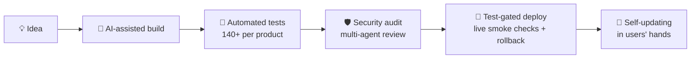

 

## ⚡ About

I direct AI like an engineering team — architecture, security, and product taste stay human;
the velocity is superhuman. The result: **production systems businesses run on daily**, built
solo, from industrial hardware integration to multi-platform apps to conversational AI over
live company data.

- 🏭 **IT Executive @ Shaji Coatings LLC** — I run the technology behind a paint business
- 🤖 **Vibe coder** — full products designed, built, audited, and shipped with AI pair-engineering
- 🛡️ **Cybersecurity analyst** — encrypted-at-rest data, tenant isolation, audits, hardened deploys

## 🚢 How I ship

Every deploy is gated by the full test suite *before* a byte reaches the server, verified by
~20 live smoke tests after, and shipped with an automatic rollback point. Products update
themselves — users always run the latest version without touching an installer.

---

## 🎨 Shaji Color Vision — flagship

> **The problem:** paint-brand software locks body shops into one supplier's colours and one workflow.
> **What I built:** a brand-neutral colour-matching & mixing platform — **one codebase, three apps**: the web, a self-updating offline Windows desktop app, and Android.

- 🔍 **213,000+ automotive colours** searchable by make/model/year/code, with variant ranking and deviation analysis
- 📷 **Camera capture** — QR paint labels decoded exactly; printed codes read by *on-device* OCR (self-hosted, zero cloud)
- 🔬 **Spectrophotometer integration** — measure a real panel with an X-Rite MA-5, match against the full library
- ⚖️ **Gravimetric mixing** — live scale-driven pours with voice guidance, auto-capture, and glove-friendly *"N g to go"* UX
- 🚗 **Volume Suggestion** — tap the panels being painted on a car diagram → exactly how much paint to mix
- 🧠 **3D paint preview** — the formula's colour rendered live on rotating car models (draco-compressed GLB)
- 📈 **Owner analytics** — per-shop BI + a cross-branch network dashboard; branded PDF job-costing and costed purchase orders
- 🏢 **Multi-tenant SaaS architecture** — companies, roles, per-user price visibility, licensing with Ed25519-signed keys
- 🔐 **Security posture** — SQLCipher-encrypted DB, AES-256-GCM field encryption for PII, CSP/HSTS, rate limits, tenant-isolation regression suite

`Flask 3` `React 18 + TypeScript` `Vite 7` `Electron + PyInstaller sidecar` `Capacitor` `SQLite/SQLCipher` `nginx` — 👉 **[mix.shajipaints.com](https://mix.shajipaints.com)**

---

## 🤖 Shaji AI — business intelligence you can talk to

> **The problem:** business answers live in databases; the people who need them don't write SQL.
> **What I built:** a conversational AI assistant over live company data — ask in plain English *or by voice*, get grounded answers, charts, and boardroom-ready files.

- 🧰 **~29 AI tools** over the live database — open read-only querying, customer payment-health scoring, AR/aging and cash-flow forecasting, proactive trend alerts, per-rep coaching
- 🗣️ **Multimodal in and out** — multilingual voice, invoice-photo OCR (vision model), document upload with relevance gating
- 📊 **One-click deliverables** — PDF / Excel / Word / PowerPoint generation, a scheduled 7 am email briefing, WhatsApp report delivery
- 🔒 **Grounded by design** — strictly read-only; every figure traces to a real query. No hallucinated numbers, ever
- ⚙️ **Production engineering** — streaming responses (SSE) with two-stage tool selection, prompt caching, retry/backoff, per-user token cost tracking, Sentry, role-based server-side auth

`Angular` `Node.js / Express` `MongoDB` `AWS Bedrock · Claude` `Deepgram + Whisper` `Puppeteer` `ECharts`

---

## ⚖️ Shaji Mixing System — the scale talks to the browser

> **The problem:** industrial weighing scales speak 1990s serial protocols and demand vendor middleware.
> **What I built:** a paint-tinting workbench where **lab balances stream live weights straight into Chrome — no middleware, no drivers, plug in USB and mix**.

- 🔌 **Driver-level hardware integration in the browser** — Sartorius (SBI protocol) and Mettler Toledo (MT-SICS) supported natively over the **Web Serial API**, correct USB vendor filtering included
- ⚡ **Real-time by engineering, not luck** — a tolerant multi-protocol frame parser, an RX loop running outside the framework's change detection for a lag-free live display, software tare where hardware tare proved unreliable
- 📇 **Shop-floor workflow** — load a colour formula, tare in-app, barcode-scan each ingredient, weigh step by step
- 🧬 **Lineage** — embedded in a full paint-industry ERP; this workbench is the direct predecessor that grew into Shaji Color Vision

`Angular` `Web Serial API` `MT-SICS / SBI` `SQLite colour DB`

---

## 📁 DOCAS — HR document collection, minus the chasing

> **The problem:** onboarding paperwork means weeks of email ping-pong and lost attachments.
> **What I built:** a bilingual portal where HR defines a checklist and every candidate gets a **secure, expiring, no-login upload link** — a live dashboard shows exactly who still owes what.

- 🔗 **Tokenized upload links** with a full lifecycle (active → submitted / expired / deactivated), per-field validation, save-then-submit UX
- 🗂️ **Pluggable storage architecture** — local disk, Google Drive, or OneDrive, switchable at runtime; prefix-routing keeps old files resolving to their original backend
- 🌍 **English/Arabic with full RTL** across both the candidate and admin experiences
- 🛠️ **Admin power tools** — dynamic form/field builder, project → position hierarchy, status roll-ups, role-based access, audit logging

`Next.js 16` `React 19` `Prisma · PostgreSQL` `JWT` `Tailwind v4` `i18next`

---

## 🧰 Arsenal

| | |
|---|---|
| **Languages** |     |
| **Frontend** |      |
| **Backend** |       |
| **Apps & Hardware** |     |
| **AI & Cloud** |     |
| **Security & Ops** |     |

 

*Colour is my trade. Software is how I sharpen it.* 🎨

